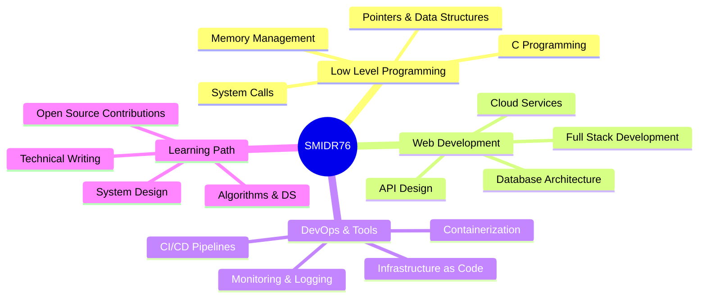

<div align="center">

<!-- ANIMATED HEADER WITH GRADIENT -->


<!-- TYPING EFFECT HEADER -->
<div align="center">
  
</div>

<!-- ANIMATED DIVIDER -->


</div>

<!-- NEON BADGES -->
<div align="center">
  
[](https://github.com/SMIDR76)
[](https://github.com/SMIDR76?tab=followers)
[](https://github.com/SMIDR76?tab=repositories)
[](https://github.com/SMIDR76)

</div>

---

##  **About Me**

<div align="center">
  
```ascii
╔══════════════════════════════════════════════════════════════════╗
║                                                                  ║
║     ██████╗██╗   ██╗██████╗ ███████╗██████╗ ██████╗ ██╗   ██╗  ║
║    ██╔════╝╚██╗ ██╔╝██╔══██╗██╔════╝██╔══██╗██╔══██╗██║   ██║  ║
║    ██║      ╚████╔╝ ██████╔╝█████╗  ██████╔╝██████╔╝██║   ██║  ║
║    ██║       ╚██╔╝  ██╔══██╗██╔══╝  ██╔══██╗██╔═══╝ ██║   ██║  ║
║    ╚██████╗   ██║   ██████╔╝███████╗██║  ██║██║     ╚██████╔╝  ║
║     ╚═════╝   ╚═╝   ╚═════╝ ╚══════╝╚═╝  ╚═╝╚═╝      ╚═════╝   ║
║                                                                  ║
║              ▬▬▬▬ DEVELOPER | CODER | INNOVATOR ▬▬▬▬            ║
║                                                                  ║
╚══════════════════════════════════════════════════════════════════╝
```

</div>


<div align="left">

```typescript
const SMIDR76 = {
    pronouns: "He" | "Him",
    location: "Digital Realm 🌐",
    role: "Code Architect",
    currentFocus: "Low-level Programming & System Design",
    languages: ["C", "C++", "Python", "JavaScript", "TypeScript"],
    technologies: {
        frontend: ["React", "Next.js", "Vue.js"],
        backend: ["Node.js", "Express", "Django"],
        databases: ["PostgreSQL", "MongoDB", "Redis"],
        tools: ["Docker", "Git", "Linux", "VS Code"]
    },
    architecture: ["Microservices", "Event-Driven", "Design Patterns"],
    currentlyLearning: "Advanced System Programming & Algorithms",
    funFact: "I debug with coffee and solve problems with neon lights ☕✨"
};
```

</div>

<br clear="both">

---

##  **Terminal Session**

<div align="center">

```bash
┌──(smidr76㉿cyberpunk)-[~/workspace]
└─$ cat about.sh

#!/bin/bash
# Cyberpunk Developer Profile v2.0

echo "Initializing neural interface..."
sleep 0.5

function display_profile() {
    echo "╔════════════════════════════════════════╗"
    echo "║     SYSTEM ACCESS GRANTED ✓            ║"
    echo "╠════════════════════════════════════════╣"
    echo "║ User: SMIDR76                          ║"
    echo "║ Status: Online [████████████] 100%     ║"
    echo "║ Mode: Development & Innovation         ║"
    echo "║ Passion: Creating Digital Solutions    ║"
    echo "║ Mission: Code Quality Excellence       ║"
    echo "╚════════════════════════════════════════╝"
}

display_profile

echo ""
echo ">> Loading skills matrix..."
echo ">> Compiling experience database..."
echo ">> All systems operational ✓"
echo ""
echo "Ready to build the future... █"

┌──(smidr76㉿cyberpunk)-[~/workspace]
└─$ _
```

</div>

---

## 🔮 **Tech Stack & Skills**

<div align="center">

### 💻 Programming Languages

<table>
<tr>
    <td align="center" width="96">
        
        <br>C
    </td>
    <td align="center" width="96">
        
        <br>C++
    </td>
    <td align="center" width="96">
        
        <br>Python
    </td>
    <td align="center" width="96">
        
        <br>JavaScript
    </td>
    <td align="center" width="96">
        
        <br>TypeScript
    </td>
    <td align="center" width="96">
        
        <br>Bash
    </td>
</tr>
</table>

### 🎨 Frontend Development

<table>
<tr>
    <td align="center" width="96">
        
        <br>React
    </td>
    <td align="center" width="96">
        
        <br>Next.js
    </td>
    <td align="center" width="96">
        
        <br>Vue.js
    </td>
    <td align="center" width="96">
        
        <br>HTML5
    </td>
    <td align="center" width="96">
        
        <br>CSS3
    </td>
    <td align="center" width="96">
        
        <br>Tailwind
    </td>
</tr>
</table>

### ⚙️ Backend & Databases

<table>
<tr>
    <td align="center" width="96">
        
        <br>Node.js
    </td>
    <td align="center" width="96">
        
        <br>Express
    </td>
    <td align="center" width="96">
        
        <br>Django
    </td>
    <td align="center" width="96">
        
        <br>PostgreSQL
    </td>
    <td align="center" width="96">
        
        <br>MongoDB
    </td>
    <td align="center" width="96">
        
        <br>Redis
    </td>
</tr>
</table>

### 🛠️ DevOps & Tools

<table>
<tr>
    <td align="center" width="96">
        
        <br>Docker
    </td>
    <td align="center" width="96">
        
        <br>Kubernetes
    </td>
    <td align="center" width="96">
        
        <br>Git
    </td>
    <td align="center" width="96">
        
        <br>GitHub
    </td>
    <td align="center" width="96">
        
        <br>Linux
    </td>
    <td align="center" width="96">
        
        <br>VS Code
    </td>
</tr>
</table>

</div>

---

## 📊 **GitHub Statistics**

<div align="center">
  
<!-- GitHub Stats Cards with Custom Theme -->
 


<!-- Contribution Streak with Custom Theme -->


<!-- Activity Graph with Custom Theme -->


<!-- Trophy Stats -->


</div>

---

## 🌟 **Featured Projects**

<div align="center">

<table>
<tr>
<td width="50%">
<h3 align="center">Project 1 - System Programming</h3>
<div align="center">  
<a href="https://github.com/SMIDR76/SMIDR76" target="_blank">

</a>
<br>
<br>
<p>
<a href="https://github.com/SMIDR76/SMIDR76" target="_blank">

</a>
</p>
</div>
</td>

<td width="50%">
<h3 align="center">Project 2 - Coming Soon</h3>
<div align="center">
<p></p>
<br>
<p>

</p>
</div>
</td>
</tr>
</table>

</div>

---

## 🎯 **Current Focus**

<div align="center">



</div>

---

## 📫 **Connect With Me**

<div align="center">

### 💼 Professional Networks

<a href="https://github.com/SMIDR76" target="_blank">

</a>
<a href="https://linkedin.com/in/your-linkedin" target="_blank">

</a>
<a href="https://twitter.com/your-twitter" target="_blank">

</a>
<a href="mailto:your-email@example.com" target="_blank">

</a>
<a href="https://discord.gg/your-discord" target="_blank">

</a>

### 💬 Let's Collaborate!

```typescript
const collaboration = {
    openTo: ["Innovative Projects", "Open Source", "Tech Discussions"],
    interests: ["System Programming", "Web Development", "Problem Solving"],
    availability: "Always open to interesting opportunities",
    reach_me: "Drop a message, let's create something amazing! 🚀"
};
```

</div>

---

## 📈 **Coding Activity**

<div align="center">

<!--START_SECTION:waka-->
<!--END_SECTION:waka-->

<!-- GitHub Metrics -->


</div>

---

## 🎨 **Code Philosophy**

<div align="center">

```ascii
╔═══════════════════════════════════════════════════════════════════════╗
║                                                                       ║
║  "Code is like humor. When you have to explain it, it's bad."        ║
║                          - Cory House                                 ║
║                                                                       ║
║  ┌─────────────────────────────────────────────────────────────┐    ║
║  │ • Write clean, maintainable code                            │    ║
║  │ • Test early, test often                                    │    ║
║  │ • Document for others (and future you)                      │    ║
║  │ • Embrace continuous learning                               │    ║
║  │ • Share knowledge with the community                        │    ║
║  └─────────────────────────────────────────────────────────────┘    ║
║                                                                       ║
╚═══════════════════════════════════════════════════════════════════════╝
```

</div>

---

## 🏆 **Achievements & Contributions**

<div align="center">

### 📅 Contribution Calendar


### 🔥 Contribution Snake

<picture>
  <source media="(prefers-color-scheme: dark)" srcset="https://raw.githubusercontent.com/SMIDR76/SMIDR76/output/github-contribution-grid-snake-dark.svg">
  <source media="(prefers-color-scheme: light)" srcset="https://raw.githubusercontent.com/SMIDR76/SMIDR76/output/github-contribution-grid-snake.svg">
  
</picture>

</div>

---

## 💡 **Random Dev Quote**

<div align="center">


</div>

---

## 🎮 **Fun Zone**

<div align="center">

### 🐍 Snake Game - Eat the Dots!


### 😂 Dev Meme of the Day


</div>

---

<div align="center">

<!-- ANIMATED FOOTER WAVE -->


### 🌐 **Visitor Count**


### ⚡ **Quick Stats**


---

<p align="center">
  
</p>

<p align="center">
  <strong>💻 Coded with passion by SMIDR76</strong>
  <br>
  <em>Made with 💜 using Markdown, SVG animations, and lots of ☕</em>
  <br>
  <sub>⭐ Star this repository if you like it!</sub>
</p>

---

```ascii
     ▄████████    ▄▄▄▄███▄▄▄▄      ▄█  ████████▄     ▄████████       ▀████    ▐████▀  ▄████████ 
    ███    ███  ▄██▀▀▀███▀▀▀██▄   ███  ███   ▀███   ███    ███         ███▌   ████▀  ███    ███ 
    ███    █▀   ███   ███   ███   ███▌ ███    ███   ███    ███          ███  ▐███    ███    █▀  
    ███         ███   ███   ███   ███▌ ███    ███  ▄███▄▄▄▄██▀          ▀███▄███▀   ▄███▄▄▄     
  ▀███████████  ███   ███   ███   ███▌ ███    ███  ▀▀███▀▀▀▀▀          ████▀██▄    ▀▀███▀▀▀     
           ███  ███   ███   ███   ███  ███    ███  ▀███████████       ▐███  ▀███     ███    █▄  
     ▄█    ███  ███   ███   ███   ███  ███   ▄███    ███    ███      ▄███     ███▄   ███    ███ 
   ▄████████▀    ▀█   ███   █▀    █▀   ████████▀     ███    ███     ████       ███▄  ██████████ 
                                                      ███    ███                                  
```

<p align="center">
  
  
  
</p>

</div>
