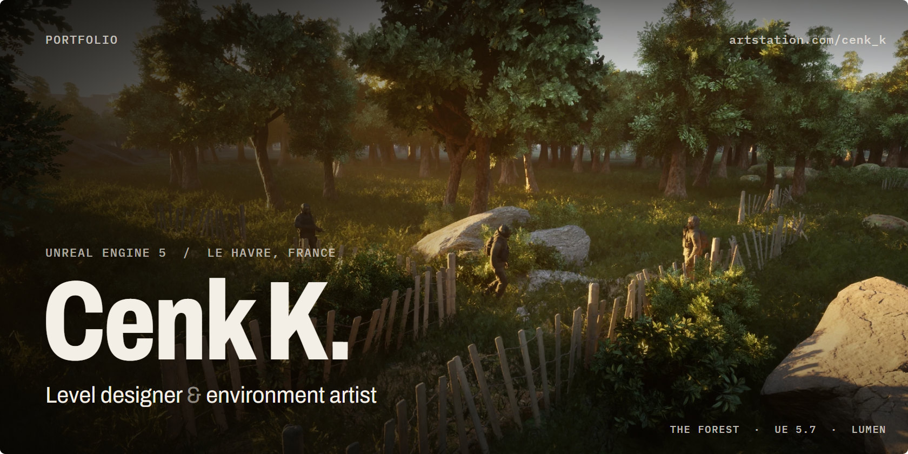
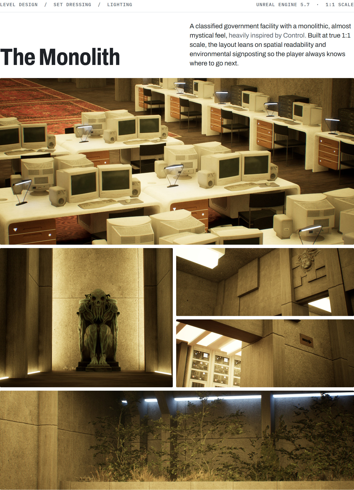
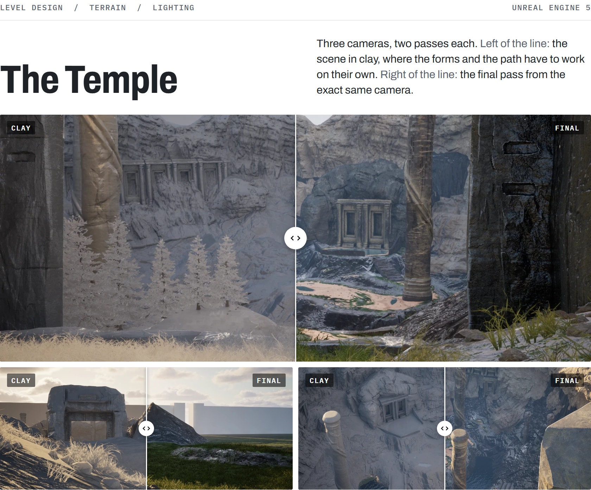
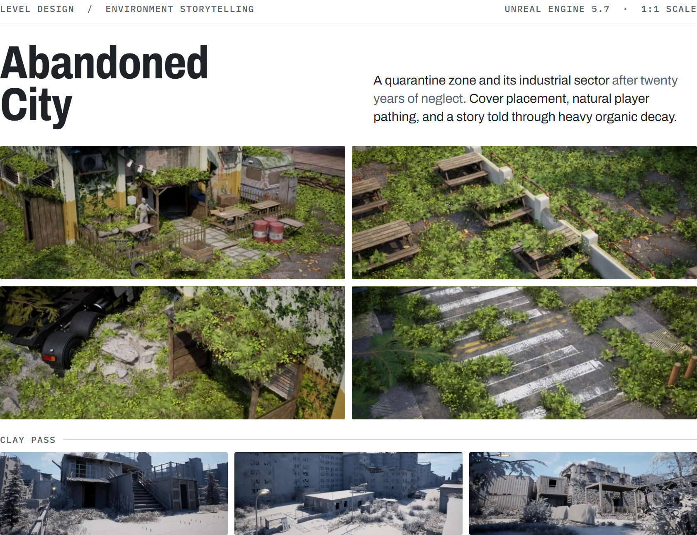
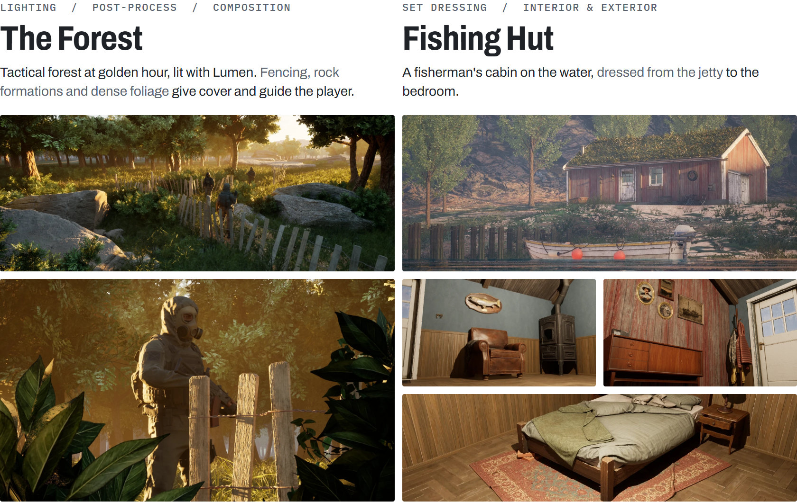

<a href="https://www.artstation.com/cenk_k">
  <picture>
    <source media="(prefers-color-scheme: dark)" srcset="assets/hero-dark.jpg">
    <source media="(prefers-color-scheme: light)" srcset="assets/hero-light.jpg">
    
  </picture>
</a>

 

I'm Cenk, a level designer and environment artist based in Le Havre, France. I work in Unreal Engine 5 and I like carrying a level the whole way: layout and greybox first, then set dressing, then the light that makes it readable.

Five projects below. Full-resolution renders and breakdowns live on [ArtStation](https://www.artstation.com/cenk_k).

  

<a href="https://www.artstation.com/artwork/xdYm1O">
  <picture>
    <source media="(prefers-color-scheme: dark)" srcset="assets/monolith-dark.jpg">
    <source media="(prefers-color-scheme: light)" srcset="assets/monolith-light.jpg">
    
  </picture>
</a>

   

<a href="https://www.artstation.com/artwork/egJ3nY">
  <picture>
    <source media="(prefers-color-scheme: dark)" srcset="assets/temple-dark.jpg">
    <source media="(prefers-color-scheme: light)" srcset="assets/temple-light.jpg">
    
  </picture>
</a>

   

<a href="https://www.artstation.com/artwork/bg6nLv">
  <picture>
    <source media="(prefers-color-scheme: dark)" srcset="assets/city-dark.jpg">
    <source media="(prefers-color-scheme: light)" srcset="assets/city-light.jpg">
    
  </picture>
</a>

   

<picture>
  <source media="(prefers-color-scheme: dark)" srcset="assets/more-dark.jpg">
  <source media="(prefers-color-scheme: light)" srcset="assets/more-light.jpg">
  
</picture>

<a href="https://www.artstation.com/artwork/Ba3Kq9">The Forest</a> &nbsp;·&nbsp; <a href="https://www.artstation.com/artwork/vzJYWv">Fishing Hut</a>

  

---

**[artstation.com/cenk_k](https://www.artstation.com/cenk_k)** 
Le Havre, France
