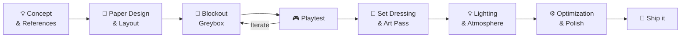

  

---

## 🎮 About me

I'm a **Level Designer** with a strong **Environment Art** background. I design spaces that are fun to play, readable to navigate and beautiful to look at, from the first paper sketch to the final lighting pass.

- 🧭 I think about **flow, pacing and player guidance** before I place a single prop
- 🧱 I iterate fast with **blockouts and playtests**
- 🌲 I bring levels to life with **set dressing, foliage, lighting and atmosphere**
- ⚙️ I keep everything **optimized and production-ready**

---

## 🛠️ Toolbox

  

---

## 🗺️ What I do

<table>
<tr>
<td width="50%" valign="top">

### 🧭 Level Design
- Paper design, top-down maps and intent docs
- Blockout / greybox and metrics
- Player flow, pacing and critical path
- Landmarks, sightlines and guidance
- Combat spaces, cover and encounters
- Verticality, exploration and secrets
- Gameplay scripting (Blueprints)
- Playtesting and iteration

</td>
<td width="50%" valign="top">

### 🌄 Environment Art
- Worldbuilding and environmental storytelling
- Landscape sculpting and terrain materials
- Modular kits and set dressing
- Foliage, PCG and procedural scattering
- Lighting, Lumen, fog and atmosphere
- Materials, decals and vertex painting
- Composition and color mood
- Optimization (Nanite, LODs, HLOD, World Partition)

</td>
</tr>
</table>

---

## 🔁 My workflow

```mermaid
flowchart LR
    A[💡 Concept<br/>& References] --> B[📝 Paper Design<br/>& Layout]
    B --> C[🧱 Blockout<br/>Greybox]
    C --> D[🎮 Playtest]
    D -->|Iterate| C
    D --> E[🌲 Set Dressing<br/>& Art Pass]
    E --> F[💡 Lighting<br/>& Atmosphere]
    F --> G[⚙️ Optimization<br/>& Polish]
    G --> H[🚀 Ship it]
```

---

## 📊 Skill map

| Domain | Level |
|---|---|
| 🧱 Blockout and layout |  |
| 🧭 Player flow and guidance |  |
| 🌲 Set dressing and foliage |  |
| 💡 Lighting and atmosphere |  |
| 🏔️ Landscape and terrain |  |
| ⚙️ PCG and procedural tools |  |
| 🔧 Blueprint scripting |  |
| 🚀 Optimization |  |

---

### 🎨 Want to see my work?

  

